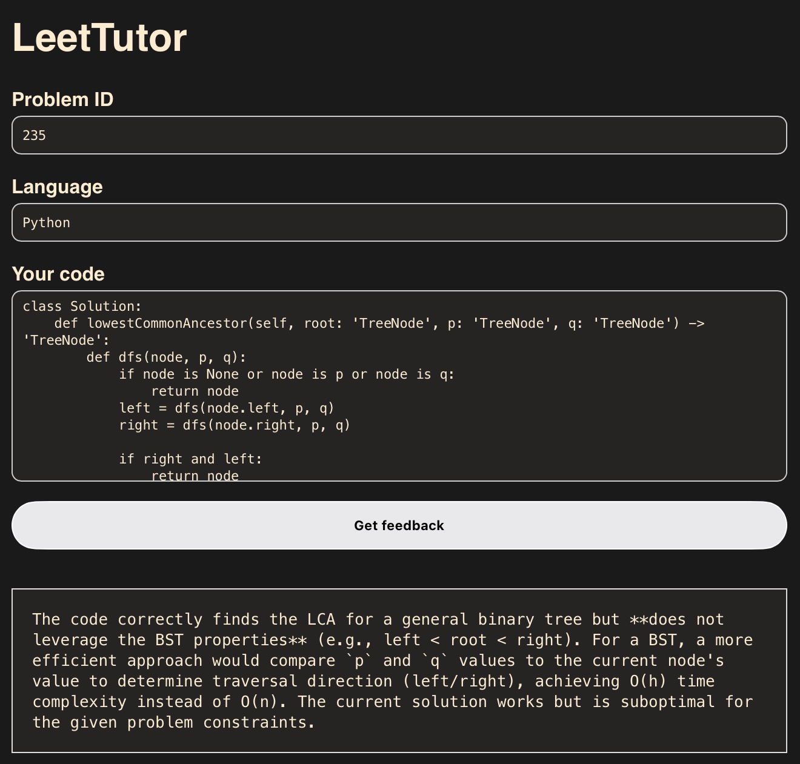

# LeetTutor

**LeetTutor** is a small but practical web app that reviews your LeetCode solutions with an LLM.  
It’s written in plain HTML / CSS / JavaScript on the front-end, with a single Cloudflare Pages Function on the back-end to keep the Groq API key secure.

---

## Highlights

- **Instant AI feedback** — queries Groq’s `qwen-32b` model and returns code-only comments in < 2 s.  
- **Zero framework** — no React, no build step; page weight ≈ 30 KB.  
- **Secure key handling** — Groq key lives in Cloudflare environment variables; never exposed to the client.  
- **One-command dev & deploy** — `wrangler pages dev` locally, `wrangler pages deploy` to production.

---

## Tech Stack

| Layer | Tooling |
|-------|---------|
| Front-end | HTML, CSS, vanilla JS (`fetch`) |
| Back-end | Cloudflare Pages Functions (`functions/api/review.js`) |
| LLM | Groq API, model `qwen/qwen3-32b` |
| Dev / CI | Wrangler 4, GitHub Actions |

---

## Preview



---

## Local Setup

```bash
# clone
git clone https://github.com/l2ggy/leettutor.git
cd leettutor

# install wrangler if you don't have it
npm install            # if wrangler is a devDependency
# or: npm i -g wrangler

# local secret (ignored by git)
echo "GROQ_API_KEY=sk-xxxxxxxx" > .dev.vars

# run
npx wrangler pages dev
# visit http://localhost:8787
```

> On older Linux distros (glibc ≤ 2.31) use Wrangler 3  
> `npm i -g wrangler@3 && wrangler pages dev`

---

## Deploy to Cloudflare Pages

1. **Create a Pages project** and point it to this repo.  
2. In *Settings → Environment Variables* add  
   ```
   GROQ_API_KEY = sk-xxxxxxxxxxxxxxxxxxxx
   ```  
3. Commit & push — Cloudflare builds and publishes automatically.

---

## Directory Layout

```
public/
  ├─ index.html       # UI
  ├─ styles.css
  ├─ main.js          # POSTs to /api/review
  └─ leetcode.json    # problem metadata
functions/
  └─ api/
      └─ review.js    # serverless Groq proxy
wrangler.toml         # Pages config
screenshots/          # README images
.gitignore
.dev.vars             # local env vars (not committed)
```

---

## License

MIT — free to fork, modify, and deploy.